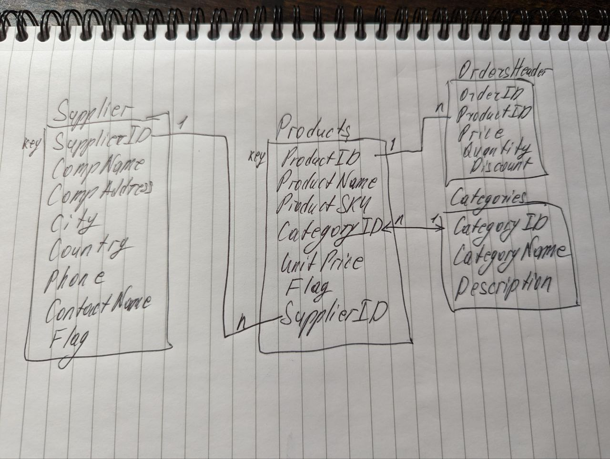

# Creating BigQuery Model + Test Data

This project is an example use case for the GenAI hackathon. It demonstrates how to generate BigQuery model and populate it with test data based on the scribble of ER diagram with Gemini.
We suggest during the hackathon people try and use whiteboards to brainstorm a diagram and then use photo of the whiteboard. That would make it more challenging.

## Code Overview

The Colab Notebook `Gemini - Create BQ Model Based on ER and Create Synthetic data` performs the following steps:

1. **Install Vertex AI SDK**.

2. **Create a function for calling the Gemini Pro model** This step creates the `generate` function to call the model. Adjust the prompt as you see fit.

3. **Get image in base64 format** The following image is then pasted ionto the notebook as base64 code (in future we will be able to grab the image from the GCS bucket or just use the uploaded one from the COlab workspace):

4. **Run the model with the image:** This step calls Gemini model to analyse the image and get the relevant BQ DDL SQL to create BigQUery model based on the ER-diagram.

5. **Run BigQuery DDLs as %%bigquery magic:** In this step we can copy and paste the code generated by the model into `%%bigquery` magic field and immidiately execute it creating the relevant BigQuery artifacts and populating them with data.

## Usage

To use this notebook, simply upload it to your Colab in VertexAI or copy-paste the code to BigQuery Studio Colab notebook.

## Dependencies

This notebook requires access to the VertexAI Generative models and some preview features.

## License

This project is licensed under the terms of the GNU General Public License version 3 (GPLv3).
